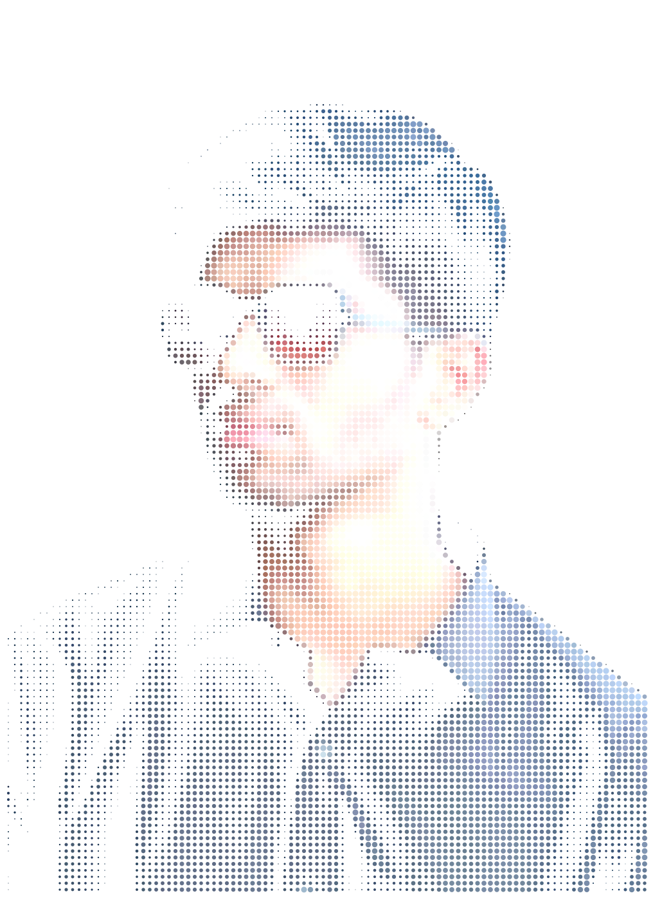
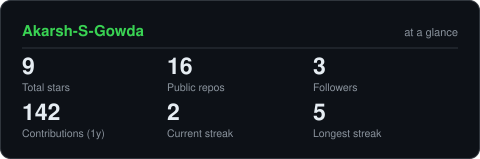
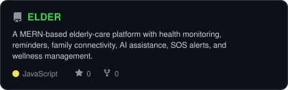
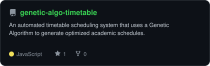
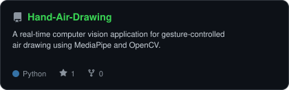
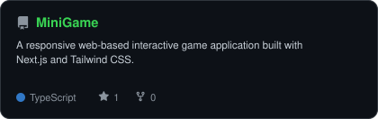

<div align="center">

<!-- PORTRAIT - generated by scripts/dotify.py from assets/jacket.png.
     Colour mode, so one file serves both GitHub themes. Regenerate with:
       python scripts/dotify.py assets/jacket.png -o assets/portrait \
         --cols 100 --equalize --detail 0.5 --color -->


<br>

<!-- NAME / TAGLINE - animated typing -->
<a href="https://github.com/Akarsh-S-Gowda">
  
</a>

<br>

<!-- SOCIALS -->
<a href="https://www.linkedin.com/in/akarshsg/"></a>
<a href="mailto:akarshsg5@gmail.com"></a>
<a href="https://codeforces.com/profile/Akarsh0525"></a>
<a href="https://leetcode.com/u/AkarshSG565/"></a>


</div>

---

## `~/` whoami

```console
$ cat about.txt
```

Hi, I'm **Akarsh S Gowda**, an Information Science & Engineering student focused on
software development, problem solving, and building practical applications.

- Currently building **[ELDER](https://github.com/Akarsh-S-Gowda/ELDER)** and exploring **AI-powered applications**
- Interested in **Web Development, Backend Development, DSA, and AI/ML**
- Currently strengthening **Java, Python, C++, SQL, and system design**
- Fun fact: **I enjoy turning ideas into working projects and learning by building.**

<br>

<div align="center">

## `~/` toolbox


</div>

---

<div align="center">

## `~/` skill radar

<table>
<tr>
<td width="50%" align="center" valign="middle">

<!-- Self-rated radar - edit assets/skills.json, the workflow redraws it -->
<picture>
  <source media="(prefers-color-scheme: dark)"  srcset="assets/radar-dark.svg">
  <source media="(prefers-color-scheme: light)" srcset="assets/radar-light.svg">
  
</picture>

</td>
<td width="50%" align="center" valign="middle">

<!-- Live radar built from real language byte counts across your repos -->
<picture>
  <source media="(prefers-color-scheme: dark)"  srcset="assets/radar-langs-dark.svg">
  <source media="(prefers-color-scheme: light)" srcset="assets/radar-langs-light.svg">
  
</picture>

</td>
</tr>
</table>

</div>

---

<div align="center">

## `~/` contribution calendar

<!-- 3D isometric calendar, regenerated every 6h by .github/workflows/metrics.yml -->


<br><br>

<!-- Snake eats the contribution graph - .github/workflows/snake.yml -->
<picture>
  <source media="(prefers-color-scheme: dark)"  srcset="https://raw.githubusercontent.com/Akarsh-S-Gowda/Akarsh-S-Gowda/output/snake-dark.svg">
  <source media="(prefers-color-scheme: light)" srcset="https://raw.githubusercontent.com/Akarsh-S-Gowda/Akarsh-S-Gowda/output/snake.svg">
  
</picture>

</div>

---

<div align="center">

## `~/` the numbers

<!-- Generated by scripts/cards.py into this repo. Deliberately NOT
     github-readme-stats / streak-stats / github-profile-trophy: those are
     shared public instances that go down and take the whole section with them. -->
<picture>
  <source media="(prefers-color-scheme: dark)"  srcset="assets/card-stats-dark.svg">
  <source media="(prefers-color-scheme: light)" srcset="assets/card-stats-light.svg">
  
</picture>

<br>


<br><br>


</div>

---

<div align="center">

## `~/` selected work

<!-- Cards generated by scripts/cards.py from assets/projects.json.
     Stars, forks and language are pulled live from the API on every run. -->
<table>
<tr>
<td width="50%">
  <a href="https://github.com/Akarsh-S-Gowda/ELDER">
    <picture>
      <source media="(prefers-color-scheme: dark)" srcset="assets/card-ELDER-dark.svg">
      <source media="(prefers-color-scheme: light)" srcset="assets/card-ELDER-light.svg">
      
    </picture>
  </a>
</td>
<td width="50%">
  <a href="https://github.com/Akarsh-S-Gowda/genetic-algo-timetable">
    <picture>
      <source media="(prefers-color-scheme: dark)" srcset="assets/card-genetic-algo-timetable-dark.svg">
      <source media="(prefers-color-scheme: light)" srcset="assets/card-genetic-algo-timetable-light.svg">
      
    </picture>
  </a>
</td>
</tr>
<tr>
<td width="50%">
  <a href="https://github.com/Akarsh-S-Gowda/Hand-Air-Drawing">
    <picture>
      <source media="(prefers-color-scheme: dark)" srcset="assets/card-Hand-Air-Drawing-dark.svg">
      <source media="(prefers-color-scheme: light)" srcset="assets/card-Hand-Air-Drawing-light.svg">
      
    </picture>
  </a>
</td>
<td width="50%">
  <a href="https://github.com/Akarsh-S-Gowda/MiniGame">
    <picture>
      <source media="(prefers-color-scheme: dark)" srcset="assets/card-MiniGame-dark.svg">
      <source media="(prefers-color-scheme: light)" srcset="assets/card-MiniGame-light.svg">
      
    </picture>
  </a>
</td>
</tr>
</table>

<sub>

| project | live | stack |
|---|---|---|
| **[ELDER](https://github.com/Akarsh-S-Gowda/ELDER)** | — | `JavaScript` `MERN` `Gemini` |
| **[genetic-algo-timetable](https://github.com/Akarsh-S-Gowda/genetic-algo-timetable)** | — | `JavaScript` `FastAPI` `Genetic Algorithm` |
| **[Hand-Air-Drawing](https://github.com/Akarsh-S-Gowda/Hand-Air-Drawing)** | — | `Python` `OpenCV` `MediaPipe` |
| **[MiniGame](https://github.com/Akarsh-S-Gowda/MiniGame)** | — | `TypeScript` `Next.js` `Tailwind CSS` |

</sub>

</div>

---

<div align="center">

<sub>`01110100 01101000 01100001 01101110 01101011 01110011 00100000 01100110 01101111 01110010 00100000 01110011 01100011 01110010 01101111 01101100 01101100 01101001 01101110 01100111`</sub>

</div>
